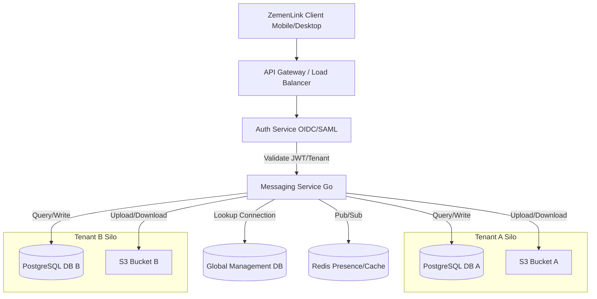

# ZemenLink High-Level System Architecture

## 1. Overview: The Modular Enterprise OS
ZemenLink is more than a messaging platform; it is architected as a **Modular Enterprise OS**. This approach treats the core messaging functionality as a "Kernel" and builds specialized compliance and integration features as hot-swappable "Modules." This allows us to ship specialized "Compliance Packs" (e.g., Banking, Government, Regional) to different tenants without bloating the core codebase.

## 2. Tenant Silo Strategy: Database-per-Tenant
To ensure absolute data isolation and comply with strict enterprise requirements, ZemenLink employs a **Database-per-Tenant** strategy.

### Implementation Details:
- **Logical Isolation:** Each tenant (Company A, Company B) has its own dedicated PostgreSQL database.
- **Connection Management:** The API Gateway/Backend uses a "Tenant Router" to determine the correct database connection string based on the user's authenticated context (Tenant ID).
- **Schema Management:** All tenant databases share the same schema. Migrations are managed centrally and applied to all tenant databases in a rolling fashion to ensure consistency.
- **Scalability:**
    - Small/Medium Tenants: Multiple logical databases can reside on a single RDS/PostgreSQL instance.
    - Large Tenants: High-usage tenants can be migrated to a dedicated RDS instance without affecting others, solving the "Noisy Neighbor" problem.
- **Maintenance & Maintainability:**
    - **Connection Pooling:** We use a centralized connection pooler (like PgBouncer) or a managed pool within the Go backend that dynamically opens/closes connections to tenant databases based on demand.
    - **Uniform Schema:** We enforce a strictly uniform schema across all tenants. No custom schema changes are allowed for individual tenants to prevent "snowflake" databases.
    - **Automated Migrations:** Tools like `golang-migrate` or `atlas` are integrated into the CI/CD pipeline. When a schema change is merged, the pipeline iterates through the list of active tenant databases and applies the migration.
    - **Health Monitoring:** Centralized monitoring (Prometheus/Grafana) tracks performance metrics per tenant database to proactively identify scaling needs.

## 3. System Flow (Mermaid)

## 4. Core Components

### Identity & Access Management (IAM)
- **Federated Identity:** ZemenLink acts as a Service Provider (SP). Integration with OIDC/SAML/Active Directory is the primary onboarding mechanism.
- **Zero Standalone Login:** Authentication is delegated to the enterprise Identity Provider (IdP) (e.g., Okta, Azure AD).

### Messaging Service (Backend) - The ZemenLink Kernel
- **Language:** Golang (for high concurrency).
- **Real-time:** WebSockets for message delivery and presence updates, backed by Redis for pub/sub and transient state.
- **Tenant Context Provider:** Every request is processed by a middleware that resolves the `TenantID` and injects a "Tenant Context" containing:
    - Database Connection String
    - Feature Flags (Manifest-based)
    - Compliance Level (e.g., "On-Premise" vs "S3-Cloud")
- **Manifest Pattern:** Every feature (Webhooks, Compliance, Regional Packs) is a module in `/internal/modules/`. A `manifest.json` defines which modules are active for which tenant.

### Interceptor Pipeline
Messages are processed through a series of "Interceptors" before persistence:
1. **Encryption Interceptor:** Handles Signal Protocol (E2EE) handshakes.
2. **Escrow Interceptor:** If the tenant manifest has `escrow: true`, this interceptor multi-encrypts the symmetric key for the corporate escrow.
3. **Persistence Interceptor:** Routes the final payload to the correct tenant-siloed database.

### E2EE with Corporate Escrow
- **Transport:** Signal Protocol for E2EE.
- **Escrow:** Messages are multi-encrypted. In addition to the recipient's public key, they are encrypted with a Corporate Escrow Public Key.
- **Access:** Decryption requires an "Escrow Access Request" through the Compliance Dashboard, mandating a 2-person approval gate.

### Frontend (Client)
- **Stack:** React Native (Mobile) and Electron (Desktop).
- **Offline-First:** Local storage using SQLite with **SQLCipher** for full-disk encryption.
- **Key Management:** Local encryption keys are derived from the user's session, never stored in plain text.

## 4. Maintenance & Compliance
- **Global Management DB:** A centralized (highly restricted) database stores tenant metadata, connection strings, and global configurations.
- **Audit Logs:** Every action in the system, especially compliance-related ones, is logged to an immutable audit trail.
