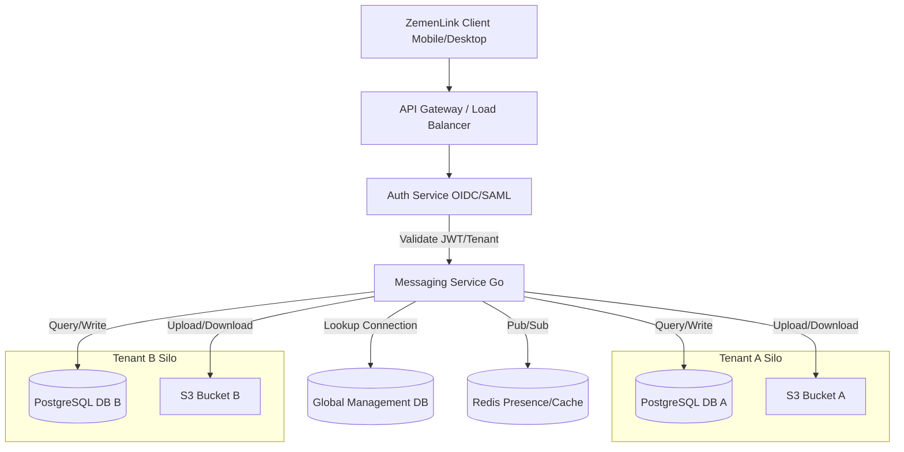
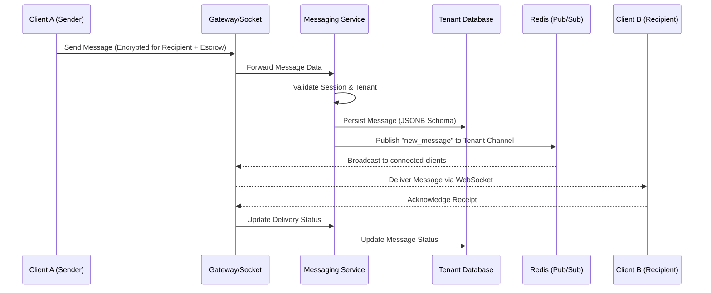
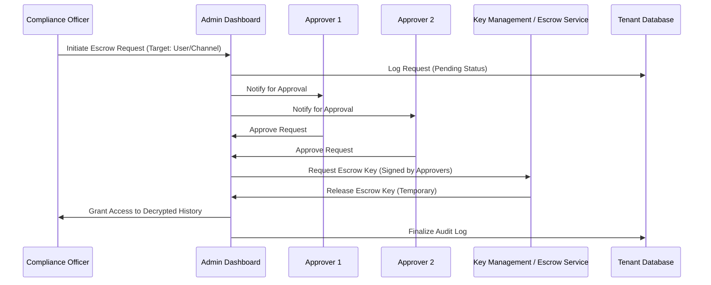

# ZemenLink System Diagrams

## 1. High-Level Architecture (Topology)

```mermaid
graph TD
    Client[ZemenLink Client Mobile/Desktop]
    Gateway[API Gateway / Load Balancer]
    AuthService[Auth Service OIDC/SAML]
    MessagingService[Messaging Service Go]
    GlobalDB[(Global Management DB)]
    Redis[(Redis Presence/Cache)]

    subgraph "Tenant A Silo"
        DB_A[(PostgreSQL DB A)]
        S3_A[S3 Bucket A]
    end

    subgraph "Tenant B Silo"
        DB_B[(PostgreSQL DB B)]
        S3_B[S3 Bucket B]
    end

    Client --> Gateway
    Gateway --> AuthService
    AuthService -- Validate JWT/Tenant --> MessagingService
    MessagingService -- Lookup Connection --> GlobalDB
    MessagingService -- Pub/Sub --> Redis
    MessagingService -- Query/Write --> DB_A
    MessagingService -- Query/Write --> DB_B
    MessagingService -- Upload/Download --> S3_A
    MessagingService -- Upload/Download --> S3_B
```

## 2. Message Delivery Flow (Sequence)

```mermaid
sequenceDiagram
    participant C1 as Client A (Sender)
    participant GS as Gateway/Socket
    participant MS as Messaging Service
    participant TDB as Tenant Database
    participant R as Redis (Pub/Sub)
    participant C2 as Client B (Recipient)

    C1->>GS: Send Message (Encrypted for Recipient + Escrow)
    GS->>MS: Forward Message Data
    MS->>MS: Validate Session & Tenant
    MS->>TDB: Persist Message (JSONB Schema)
    MS->>R: Publish "new_message" to Tenant Channel
    R-->>GS: Broadcast to connected clients
    GS-->>C2: Deliver Message via WebSocket
    C2-->>GS: Acknowledge Receipt
    GS->>MS: Update Delivery Status
    MS->>TDB: Update Message Status
```

## 3. Escrow Access Flow (Compliance)

```mermaid
sequenceDiagram
    participant CO as Compliance Officer
    participant AD as Admin Dashboard
    participant A1 as Approver 1
    participant A2 as Approver 2
    participant KS as Key Management / Escrow Service
    participant TDB as Tenant Database

    CO->>AD: Initiate Escrow Request (Target: User/Channel)
    AD->>TDB: Log Request (Pending Status)
    AD->>A1: Notify for Approval
    AD->>A2: Notify for Approval
    A1->>AD: Approve Request
    A2->>AD: Approve Request
    AD->>KS: Request Escrow Key (Signed by Approvers)
    KS->>AD: Release Escrow Key (Temporary)
    AD->>CO: Grant Access to Decrypted History
    AD->>TDB: Finalize Audit Log
```
